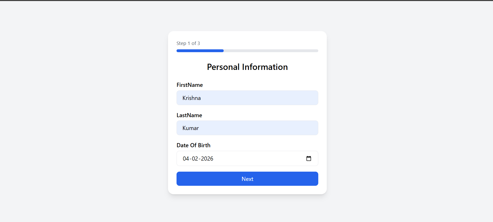
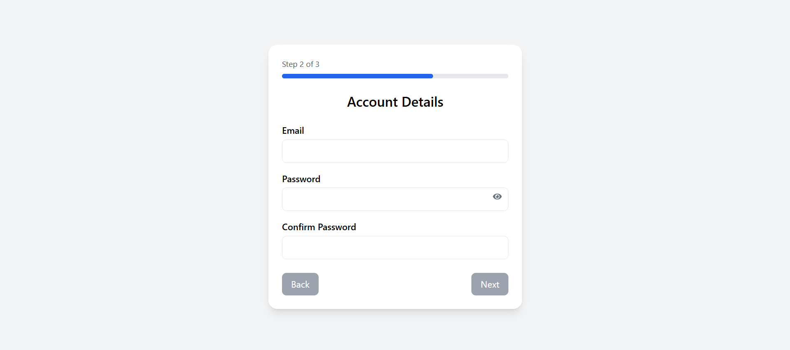
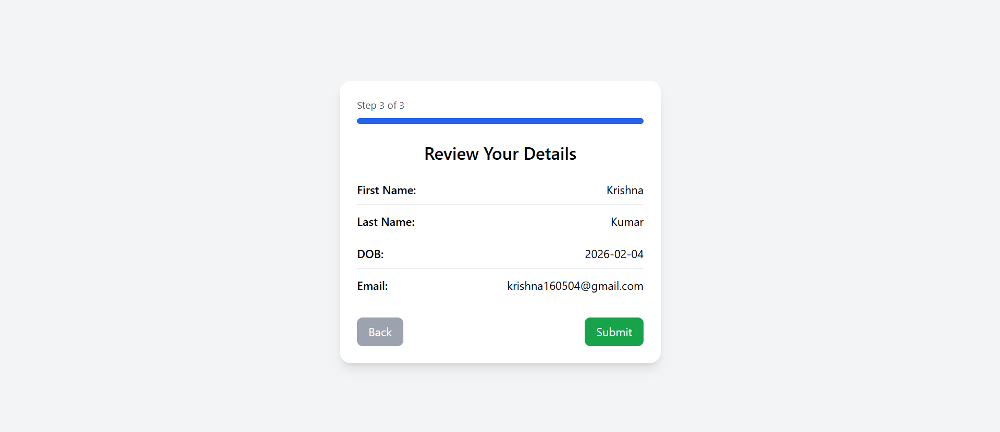

# 📄 Registration Wizard – Multi-Step Onboarding Form

## 📸 Project Preview

### 🧾 Step 1 – Personal Information


### 🔐 Step 2 – Account Details


### 👀 Step 3 – Review & Submit


## 🌐 Live Demo
🔗 **Live Project:** [https://registration-wizard-seven.vercel.app/](https://registration-wizard-seven.vercel.app/)

A modern Multi-Step Registration Wizard built using React (Vite) + Tailwind CSS.

This project simulates a real-world onboarding flow (like SaaS or banking applications) and demonstrates:
- Controlled Components
- State Management
- Real-time Validation
- UX Optimization
- Multi-step Navigation

## 🚀 Features

### ✅ Level 1 – Core Multi-Step Logic
- Multi-step form (3-step wizard)
- Centralized state management using `useState`
- Data persistence when navigating Back
- Conditional rendering for steps
- Review screen before submission
- Success screen after submit
- Console logging final structured form data

### ✅ Level 2 – Validation & UX Enhancements
- Real-time validation for all fields
- Email format validation
- Password minimum length (8 characters)
- Confirm password match check
- Disabled navigation buttons until valid
- Password visibility toggle (Eye icon)
- Dynamic progress bar (Step X of 3)
- Clean, responsive Tailwind UI

## 🧠 Key Concepts Demonstrated
- **Controlled Components** – All inputs controlled via parent state
- **State Lifting** – Form data stored in `App.jsx`
- **Conditional Rendering** – Step-based UI switching
- **Dynamic Validation Logic**
- **UX-first Design**
- **Reusable Components**

This mirrors real-world frontend architecture used in modern SaaS applications.

## 📂 Project Structure
```text
registration-wizard/
│
├── src/
│   ├── assets/
│   │   ├── pi.png
│   │   ├── account.png
│   │   └── review.png
│   │
│   ├── components/
│   │   ├── steps/
│   │   │   ├── Step1Personal.jsx
│   │   │   ├── Step2Account.jsx
│   │   │   ├── Step3Review.jsx
│   │   │
│   │   ├── ProgressBar.jsx
│   │   └── SuccessScreen.jsx
│   │
│   ├── App.jsx
│   └── main.jsx
│
├── README.md
├── Prompts.md
└── package.json
```

## 🛠️ Technologies Used
- ⚛️ React (Vite)
- 🎨 Tailwind CSS
- 🔁 React Hooks (`useState`)
- 🎯 React Icons
- 🚀 Vercel (Deployment)

*No external form libraries were used (manual validation implemented intentionally).*

## 🧪 How to Run the Project

**1️⃣ Clone the repository**
```bash
git clone <repository-url>
cd registration-wizard
```

**2️⃣ Install dependencies**
```bash
npm install
```

**3️⃣ Run development server**
```bash
npm run dev
```

**4️⃣ Open in browser**
`http://localhost:5173`

## 📊 Validation Rules Implemented
| Field | Rule |
|---|---|
| First Name | Required |
| Last Name | Required |
| Date of Birth | Required |
| Email | Must include '@' |
| Password | Minimum 8 characters |
| Confirm Password | Must match password |

*Navigation buttons remain disabled until the current step is valid.*

## 🎥 Internship Submission Notes
This project was built as **Week 7 Assignment – Registration Wizard**
Under the **Prodesk IT Internship Program**.

Includes:
- Multi-step logic
- Real-time validation
- UX improvements
- Clean component architecture
- `Prompts.md` for AI interaction transparency

## 🤖 AI Assistance Disclaimer
AI tools were used for:
- Understanding validation strategies
- Structuring multi-step form architecture
- Improving UX and component organization
- Debugging state management issues

*All code was manually implemented, tested, and refined.*
*AI interaction history is documented in `Prompts.md`.*

## 👨‍💻 Author
**Krishna Kumar**  
Frontend Developer Intern – Prodesk IT
